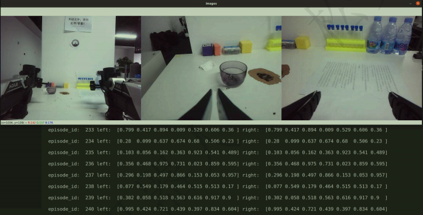

## 数据采集

可通过统一启动脚本，启动设备，并做如下检查：
1.启动机械臂遥操作模式
2.检测机械臂、相机是否运行成功
3.如果需要采集agv小车的数据，先将agv小车上电，并检查是否运行成功

# 启动采集脚本：collect_data.py
1.输入用户名
2.选择task任务名称
3.确认采集

采集过程中，终端会显示 Frame data: xxx 打印信息,即表示正在记录数据集
终端打印 sync fail 是正常的,表示当前时刻没同步传感器数据, 只要终端不是一直 sync fail 而没有 Frame data: xxx 输出, 都是正常现象

## 可视化数据采集

运行脚本python visualize_episodes.py --dataset_dir {./data} --task_name {aloha_mobile_dummy} --episode {0}
传入采集数据保存的文件信息

运行完成后,会在 ${dataset_dir}/{task_name} 下产
生 episode_${idx}_qpos.png 、 episode_${idx}_base_action.png
与 episode_${idx}_video.mp4 文件,目录结构如下：
collect_data
├── data
│ ├── aloha_mobile_dummy
│ │ └── episode_0.hdf5
│ ├── episode_0_base_action.png # base_action图
│ ├── episode_0_qpos.png # qpos图
│ └── episode_0_video.mp4 # 彩图图视频流

## 重播数据集

运行脚本：python replay_data.py --dataset_dir ./data --task_name aloha_mobile_dummy --episode_idx 0
参数说明
• --dataset_dir 数据集保存路径
• --task_name 任务名,作为数据集的文件名
• --episode_idx 动作分块索引号

将采集的数据集包,使用ros发布该数据包的彩色图和机械臂关节姿态
发布该数据包后,cobot_magic可订阅该消息进行示教模式跟随运动
运行replay_data.py请关闭遥操作代码窗口, 只启动推理脚本即可

